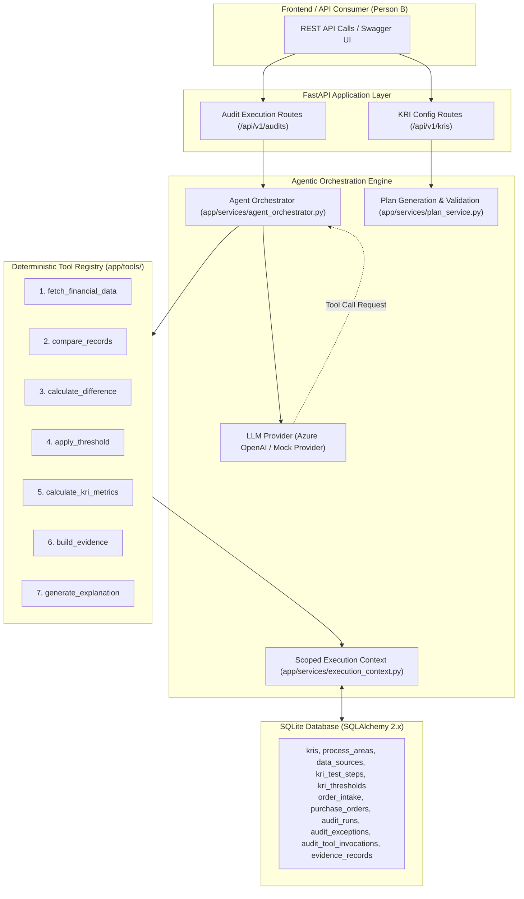

# Azure OpenAI Agentic Continuous Internal Audit KRI Engine (POC)

A production-grade, modular backend-only Proof of Concept (POC) for a configurable **Continuous Internal Audit Key Risk Indicator (KRI) Engine**.

The system utilizes **Azure OpenAI Function / Tool Calling** as an intelligent orchestration layer to interpret natural language internal audit test steps defined by audit administrators and dynamically select registered, deterministic business logic tools. All mathematical calculations, record matching, threshold evaluations, and metrics are computed deterministically in Python/SQLAlchemy with complete reproducible evidence.

---

## 🏛️ System Architecture



---

## 🚀 Key Features

1. **Agentic Orchestration without LLM Hallucinations**:
   - Azure OpenAI interprets administrator natural language instructions (e.g. *"Match order intake with POs and flag variance over 10%"*) and selects registered tools.
   - LLMs **never** execute raw code, arbitrary SQL, or perform financial math.
2. **7 Controlled Deterministic Audit Tools**:
   - `fetch_financial_data`: Extracts scoped populations without leaking full datasets into LLM context.
   - `compare_records`: Deterministic matching across order IDs and fallback PO references.
   - `calculate_difference`: Absolute and percentage variance calculations with zero-denominator safeguards.
   - `apply_threshold`: Authoritative variance threshold evaluation and severity assignment (`LOW`, `MEDIUM`, `HIGH`, `CRITICAL`).
   - `calculate_kri_metrics`: Aggregate population statistics, mismatch value exposure, and rate calculations.
   - `build_evidence`: Cryptographic sha256 reproducibility hashes and complete transaction provenance.
   - `generate_explanation`: Structured, plain-English explanations with strict numerical preservation.
3. **Dual LLM Provider System**:
   - Live **`AzureOpenAIProvider`** using the official OpenAI Python SDK.
   - Offline **`MockLLMProvider`** enabling 100% test coverage and full local execution without live cloud credentials.
4. **Complete Audit Traceability**:
   - Every tool call, argument, execution latency, and output payload is persisted in `audit_tool_invocations`.
5. **Person B Ready**:
   - Clean, standardized REST API endpoints with full CORS support and rich interactive Swagger UI documentation at `/docs`.

---

## 🛠️ Technology Stack

- **Language**: Python 3.10+ / 3.11+
- **API Framework**: FastAPI
- **Database**: SQLite with SQLAlchemy 2.x ORM
- **Data Validation & Schemas**: Pydantic v2 & Pydantic Settings
- **LLM Orchestration**: Azure OpenAI Chat Completions with Function Calling (`openai>=1.14.0`)
- **Testing**: Pytest & Pytest-Asyncio, HTTPX
- **Server**: Uvicorn

---

## ⚙️ Configuration & Environment Variables

Copy `.env.example` to `.env`:

```bash
cp .env.example .env
```

| Variable | Description | Default / Example |
| :--- | :--- | :--- |
| `APP_NAME` | Name of the service | `Continuous Internal Audit KRI Engine` |
| `DATABASE_URL` | SQLite database URI | `sqlite:///./kri_audit.db` |
| `USE_MOCK_LLM` | Set `true` for offline execution / testing, `false` for live Azure OpenAI | `true` |
| `AZURE_OPENAI_ENDPOINT` | Azure OpenAI resource endpoint | `https://your-resource.openai.azure.com/` |
| `AZURE_OPENAI_API_KEY` | Azure OpenAI secret key | `your-azure-openai-api-key` |
| `AZURE_OPENAI_API_VERSION` | API version | `2024-02-15-preview` |
| `AZURE_OPENAI_DEPLOYMENT_NAME` | Deployed model name | `gpt-4o` |
| `MAX_TOOL_CALLS_PER_RUN` | Max invocation safeguard limit | `15` |
| `LLM_TEMPERATURE` | Model temperature (deterministic) | `0.0` |

---

## 🏃 Quickstart Guide

### 1. Activate Virtual Environment & Install Dependencies
```powershell
# In PowerShell (Windows)
.\venv\Scripts\activate
pip install -r requirements.txt
```

### 2. Reset and Seed Database
Initializes the SQLite schema, configures master process areas, data sources, the primary Order Intake vs PO KRI (`KRI-O2C-001`), and generates 80 deterministic mock transactions:
```powershell
python scripts/reset_database.py
```

### 3. Run the FastAPI Server
```powershell
python -m uvicorn app.main:app --reload --port 8000
```
Interactive OpenAPI documentation will be accessible at:
- **Swagger UI**: [http://127.0.0.1:8000/docs](http://127.0.0.1:8000/docs)
- **ReDoc**: [http://127.0.0.1:8000/redoc](http://127.0.0.1:8000/redoc)

### 4. Run the Automated Test Suite
```powershell
pytest -v
```

---

## 📊 Primary KRI & Mock Data Scenarios

### KRI: `Order Intake vs Purchase Order Reconciliation` (`KRI-O2C-001`)
- **Process Area**: O2C (Order to Cash)
- **Risk**: Revenue leakage, unauthorized commercial commitments, and pricing variances.
- **Goal**: Reconcile 100% of customer orders in SAP ECC against Purchase Orders in Red Box with variance under 10%.

### 80 Deterministic Test Records Distribution
| Record Range | Scenario Description | Expected Outcome |
| :--- | :--- | :--- |
| **ORD-2026001 to 045** (45 records) | Exact Match (Order Amount == PO Amount) | Matched (No Exception) |
| **ORD-2026046 to 060** (15 records) | Minor Variance within 10% (2% - 8% difference) | Within Tolerance (No Exception) |
| **ORD-2026061 to 070** (10 records) | Major Variance exceeding 10% (15% - 75% difference) | Flagged as `AMOUNT_MISMATCH` Exception |
| **ORD-2026071 to 078** (8 records) | Missing Purchase Order in Red Box | Flagged as `MISSING_PO` Exception |
| **ORD-2026079 to 080** (2 records) | Ambiguous / Duplicate Matching POs | Flagged as `AMBIGUOUS_MATCH` Exception |

---

## 🔌 Person B Frontend Integration Guide

Person B (Frontend Engineer) can integrate against the following documented REST APIs. CORS is enabled for all origins.

### 1. KRI Management APIs

#### List KRIs
- **Endpoint**: `GET /api/v1/kris`
- **Response**: Array of KRI configurations including active steps, thresholds, and schedules.

#### Get KRI Details
- **Endpoint**: `GET /api/v1/kris/{kri_id}`

#### Create / Update KRI
- **Endpoint**: `POST /api/v1/kris`
- **Request Body**:
```json
{
  "identifier": "KRI-O2C-002",
  "name": "Order Booking vs Contract Price Variance",
  "process_area_id": 1,
  "indicator_type": "LEADING",
  "risk_description": "Price discrepancy between booked order and signed contract.",
  "end_goal": "Ensure 100% price alignment within 5% tolerance.",
  "data_source_ids": [1, 5]
}
```

#### Test Step Management
- `POST /api/v1/kris/{kri_id}/steps` - Add a step
- `PUT /api/v1/kris/{kri_id}/steps/{step_id}` - Update a step
- `DELETE /api/v1/kris/{kri_id}/steps/{step_id}` - Delete a step
- `PATCH /api/v1/kris/{kri_id}/steps/reorder` - Reorder steps:
```json
{
  "reorder_list": [
    { "step_id": 2, "new_step_number": 1 },
    { "step_id": 1, "new_step_number": 2 }
  ]
}
```

#### Generate & Validate Execution Plan
- `POST /api/v1/kris/{kri_id}/generate-plan`
- `POST /api/v1/kris/{kri_id}/validate`
- `PATCH /api/v1/kris/{kri_id}/status` with `{"status": "ACTIVE"}`

---

### 2. Audit Execution & Results APIs

#### Run an Audit
- **Endpoint**: `POST /api/v1/audits/run`
- **Request Body**:
```json
{
  "kri_id": 1,
  "start_date": "2026-01-01",
  "end_date": "2026-03-31",
  "customer_name": null
}
```
- **Response Example**:
```json
{
  "id": 1,
  "run_reference": "run_a1b2c3d4",
  "kri_id": 1,
  "status": "COMPLETED",
  "start_date": "2026-01-01",
  "end_date": "2026-03-31",
  "total_transactions": 80,
  "matched_count": 60,
  "missing_po_count": 8,
  "amount_mismatch_count": 10,
  "total_exceptions": 20,
  "total_order_value": 10542318.45,
  "exception_order_value": 2684120.10,
  "mismatch_value_percentage": 25.46,
  "exception_rate_by_count": 25.0,
  "exception_rate_by_value": 25.46,
  "started_at": "2026-09-22T12:30:00Z",
  "completed_at": "2026-09-22T12:30:05Z",
  "metrics": { ... }
}
```

#### Retrieve Audit Exceptions
- **Endpoint**: `GET /api/v1/audits/{run_id}/exceptions?exception_type=AMOUNT_MISMATCH&severity=HIGH`
- **Response Example**:
```json
[
  {
    "id": 14,
    "exception_reference": "exc_f9210c4a",
    "order_id": "ORD-2026065",
    "po_id": "PO-800065",
    "exception_type": "AMOUNT_MISMATCH",
    "severity": "HIGH",
    "reason_code": "AMOUNT_MISMATCH",
    "order_amount": 184500.00,
    "po_amount": 125000.00,
    "difference_amount": 59500.00,
    "difference_percentage": 47.60,
    "threshold_value": 10.0,
    "review_status": "PENDING_REVIEW",
    "created_at": "2026-09-22T12:30:04Z"
  }
]
```

#### Update Exception Review Status
- **Endpoint**: `PATCH /api/v1/audits/exceptions/{exception_reference}/status`
- **Request Body**:
```json
{
  "review_status": "APPROVED"
}
```

#### Retrieve Complete Evidence Package
- **Endpoint**: `GET /api/v1/audits/evidence/{evidence_reference}`
- **Response Example**:
```json
{
  "evidence_reference": "ev_882b4a10",
  "exception_reference": "exc_f9210c4a",
  "order_id": "ORD-2026065",
  "source_system": "SAP_ECC",
  "order_record": {
    "order_id": "ORD-2026065",
    "customer_name": "Apex Industries",
    "order_date": "2026-02-14",
    "order_amount": 184500.00,
    "currency": "USD",
    "po_reference": "PO-800065",
    "source_system": "SAP_ECC",
    "status": "BOOKED"
  },
  "po_record": {
    "po_id": "PO-800065",
    "order_id": "ORD-2026065",
    "vendor_id": "VEND-102",
    "po_date": "2026-02-12",
    "po_amount": 125000.00,
    "currency": "USD",
    "source_system": "RED_BOX_PO",
    "status": "APPROVED"
  },
  "calculation_details": {
    "left_value": 184500.0,
    "right_value": 125000.0,
    "difference": 59500.0,
    "difference_percentage": 47.60
  },
  "threshold_details": {
    "threshold_type": "PERCENTAGE_DIFFERENCE",
    "operator": ">",
    "threshold_value": 10.0
  },
  "explanation": "The order amount ($184,500.00) is 47.60% higher than the PO amount ($125,000.00) by a difference of $59,500.00, exceeding the configured 10.0% threshold."
}
```

#### Retrieve Tool Invocation Trace
- **Endpoint**: `GET /api/v1/audits/{run_id}/trace`
- Returns chronological tool execution steps with parameters, responses, and latency in milliseconds.

#### Retrieve Structured Execution Logs & Step Events
- **Endpoint**: `GET /api/v1/audits/{run_id}/logs`
- Returns chronological JSON event logs of every initialization step, planned step, LLM interaction, tool call, flagged exception, metric computation, and file path.

#### Download / View Raw Trace Log File
- **Endpoint**: `GET /api/v1/audits/{run_id}/logs/file`
- Returns the complete plain-text execution log file stored on disk (`logs/runs/{run_reference}.log`).

---

## 🪵 Multi-Target Logging Architecture

Every audit execution produces detailed, auditable logs across 4 destinations:
1. **Human-Readable Log File (`logs/runs/{run_reference}.log`)**: Contains complete headers, timestamps, step numbers, indented payloads, and execution summaries.
2. **Structured JSON Event Log (`logs/runs/{run_reference}.json`)**: Machine-readable JSON array of all timestamped lifecycle events.
3. **Database Records (`audit_run_logs` table)**: Persisted relational log events queryable by run ID.
4. **Console Output**: Real-time progress updates stream to stdout.

---

## 🔒 Security & Governance Safeguards


1. **Deterministic Authority**: The LLM functions purely as an orchestration layer. Tool calculations and database evaluations are authoritative.
2. **Tool Allowlisting**: Strict schema enforcement and parameter validation with Pydantic v2. Unregistered tools and arbitrary code execution are completely blocked.
3. **Parameter Scoping**: Datasets are referenced via tokenized handles (`dataset_orders_xxx`) ensuring sensitive bulk financial records are not unnecessarily sent through the LLM context.
4. **Secret Masking**: Sensitive environment variables and credentials are automatically masked from all logs and configuration dictionaries.
5. **Traceability**: All agentic tool calls, parameters, and responses are recorded in the database for auditing and regulatory compliance.

---

## 📋 Project Structure

```text
e:\Projects\kri-poc\
├── app/
│   ├── main.py
│   ├── core/
│   │   ├── config.py
│   │   ├── database.py
│   │   └── security.py
│   ├── models/
│   │   ├── kri.py
│   │   ├── financial.py
│   │   └── audit.py
│   ├── schemas/
│   │   ├── common.py
│   │   ├── kri.py
│   │   ├── audit.py
│   │   └── tools.py
│   ├── repositories/
│   │   ├── kri_repository.py
│   │   ├── financial_repository.py
│   │   └── audit_repository.py
│   ├── tools/
│   │   ├── __init__.py
│   │   ├── base.py
│   │   ├── registry.py
│   │   ├── fetch_financial_data.py
│   │   ├── compare_records.py
│   │   ├── calculate_difference.py
│   │   ├── apply_threshold.py
│   │   ├── calculate_kri_metrics.py
│   │   ├── build_evidence.py
│   │   └── generate_explanation.py
│   ├── services/
│   │   ├── llm_provider.py
│   │   ├── execution_context.py
│   │   ├── plan_service.py
│   │   ├── agent_orchestrator.py
│   │   └── audit_service.py
│   ├── api/
│   │   └── v1/
│   │       ├── __init__.py
│   │       ├── kri_routes.py
│   │       └── audit_routes.py
│   └── prompts/
│       ├── agent_system_prompt.txt
│       └── planner_prompt.txt
├── scripts/
│   ├── seed_data.py
│   ├── seed_kri.py
│   └── reset_database.py
├── tests/
│   ├── conftest.py
│   ├── unit/
│   │   ├── test_tools.py
│   │   ├── test_plan_service.py
│   │   ├── test_agent_orchestrator.py
│   │   └── test_kri_repository.py
│   └── integration/
│       └── test_kri_flow.py
├── .env.example
├── .env
├── requirements.txt
├── pytest.ini
├── TRACKER.md
├── prompt.md
└── README.md
```
